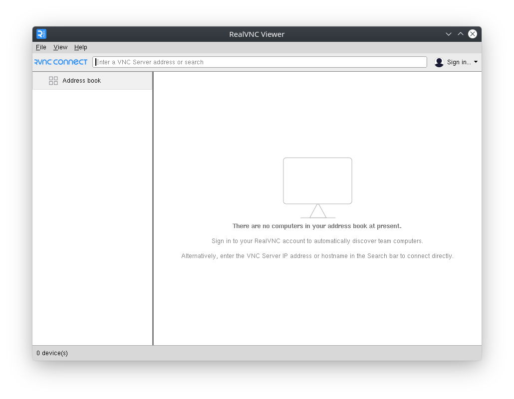
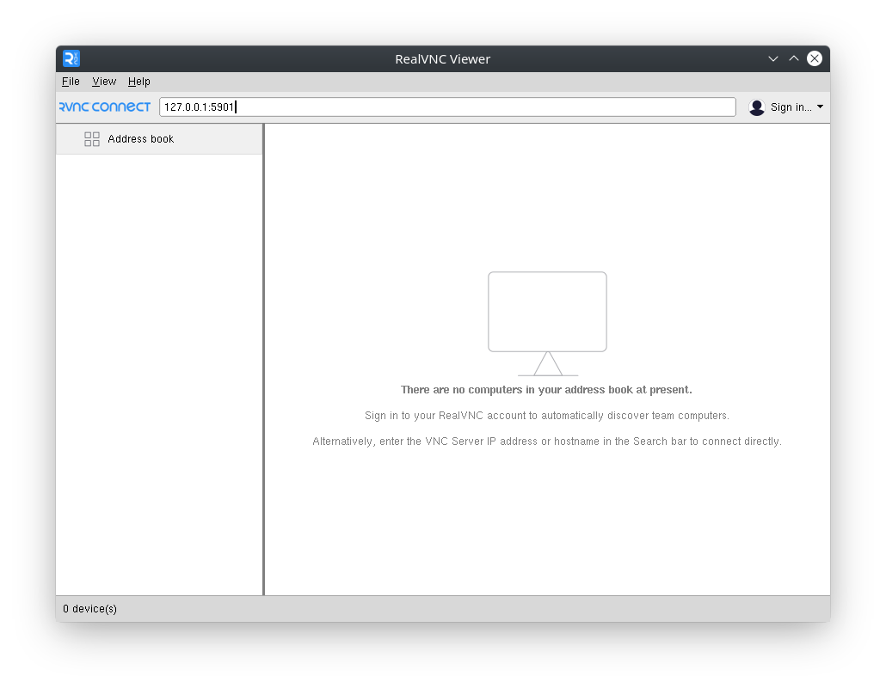
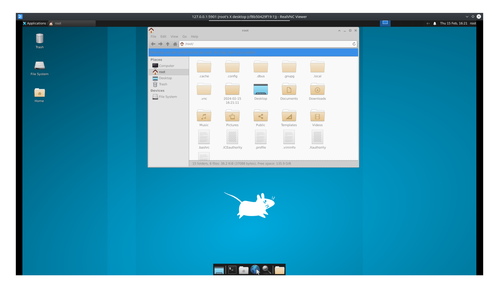
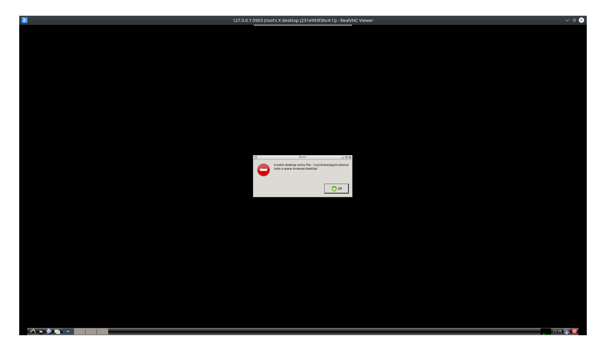

# KTPM bài tập tuần 1

**Sinh viên: Công Nghĩa Hiếu - 21020540 - K66CC**

## `Docker`, `docker compose` là gì

### Docker

- Docker là công nghệ ảo hóa, tạo môi trường ảo dựa trên máy host. Hiểu đơn giản, Docker cũng tạo môi trường ảo như các phần mềm Virtual Box, VMWare
- Docker tạo môi trường ảo dựa trên tài nguyên (CPU, RAM, ...) và thư viện hay kernel của máy host. Trong khi đó, Virtual Box hay VMWare tuy có sử dụng tài nguyên chung với máy host nhưng thư viện hay kernel lại dùng độc lập.
- Do đó môi trường ảo do Docker tạo ra (gọi là container) nhỏ gọn, nhẹ nhàng, tốn ít tài nguyên hơn so với môi trường ảo (gọi là máy ảo) do Virtual Box hay VMWare tạo ra

### `Docker file` và `docker compose`

- `Docker file` được sử dụng để hỗ trợ tạo image hoặc nhiều image, đơn giản hóa quá trình tạo lập và cài đặt môi trường ảo theo nhu cầu sử dụng
- `Docker compose` là công cụ thực hiện quản lý việc chạy các image thành container (image có thể do Docker file tạo ra). Ngoài ra `Docker compose` còn có thể quản lý volume (lưu trữ), network giữa các container hay biến môi trường

## `Linux` vs `Unix` vs `BSD` vs `*nix` ? `macOS` thuộc loại nào

- `Unix` là OS gốc, bắt nguồn cho các OS khác như Linux, BSD. Tuy nhiên `Unix` là **close source**
- `BSD` (Berkeley Software Distribution) là 1 phiên bản của Unix (còn gọi là `unix like` hay `*nix`). `BSD` ban đầu là **close source** tuy nhiên sau này xuất hiện `FreeBSD` là 1 phiên bản **open source** của `BSD`
- `Linux` là kernel có chức năng lấy cảm hứng từ `Unix`, được viết lại từ đầu bởi **Linus Tovarlds** và hoàn toàn **open source**. `Linux` không phải là 1 hệ điều hành hoàn chỉnh, nó chỉ là kernel (giống như động cơ xe ô tô). `Linux` kết hợp với `GNU` (GNU giống như các phần còn lại phụ tùng cho xe ô tô) tạo thành `GNU/Linux` mới được gọi là 1 OS hoàn chỉnh. Các OS như `Ubuntu`, `Debian`, `Fedora` là các distribution của `GNU/Linux`
- `Linux`, `BSD` hay các biến thể, distribution của 2 thứ này đều được gọi là `*nix` hay `unix-like`
- `macOS` là 1 nhánh của `BSD`

## `Alpine` vs `Ubuntu` ?

### Dependencies, kich thước

- Alpine sử dụng `musl libc` và `busy box` nên rất kích thước nhỏ gọn
- Ubuntu sử dụng `glibc` và nhiều package khác nên kích thước lớn hơn rất nhiều so với Alpine

### Package manager

- Alpine sử dụng `apk`
- Ubuntu sử dụng `apt`

## `VNC`

- VNC (Virtual Network Computing) là công nghệ giúp điều khiển máy tính từ xa (tác dụng như TeamView). Có thể truy cập máy tính từ xa, chia sẻ màn hình, điều khiển chuột, bàn phím.
- VNC hoạt động trên một mô hình server / client. VNC Server được cài đặt trên máy tính bạn muốn điều khiển, VNC Viewer được cài đặt trên máy tính bạn muốn có quyền điều khiển.

## Demo VNC

### Hướng dẫn cài đặt Desktop environment `xfce` thông qua Docker và VNC

NOTE:

- Đảm bảo đã cài đặt Docker
- [Tham khảo cài đặt và cấu hình VNC Server cho DE `xfce`](https://www.digitalocean.com/community/tutorials/how-to-install-and-configure-vnc-on-ubuntu-22-04)

#### B1: Cài đặt VNC Server, Desktop environment `xfce` thông qua Docker

- Pull image ubuntu:

```bash
docker pull ubuntu:latest
```

- Chạy image ubuntu và vào terminal:

```bash
docker run -it --name vnc-xfce -p 5901:5901 -e USER=admin ubuntu:latest
```

- Cài các package cần thiết. Lưu ý khi cài đặt `xfce4` cần nhập khu vực, múi giờ:

```bash
apt update -y && apt install vim xfce4 xfce4-goodies tightvncserver -y
```

- Khởi tạo VNC server và nhập password. Ví dụ đặt password là `admin123`:

```bash
vncserver
```

```bash
Output
You will require a password to access your desktops.

Password:
Verify:
```

- Config VNC server:

```bash
vncserver -kill :1 # Kill server vừa chạy

mv ~/.vnc/xstartup ~/.vnc/xstartup.bak # Backup file xstartup

vim ~/.vnc/xstartup # Sửa đổi nội dung của file xstartup
```

- Nhập nội dung sau vào file `~/.vnc/xstartup`

```bash
#!/bin/bash
xrdb $HOME/.Xresources
startxfce4 &
```

- Sau khi sửa đổi nội dung, cấp quyền thực thi cho file `xstartup`:

```bash
chmod 777 ~/.vnc/xstartup
```

- Khởi động lại VNC server. Lưu ý, không sử dụng tham số `-localhost`, sử dụng tham số `-geometry` để tùy chỉnh độ phân giải màn hình

```bash
vncserver -geometry 1920x1080 :1
```

#### B2: Cài đặt VNC Client

- Sử dụng VNC Client. Hướng dẫn này sẽ sử dụng [VNC Viewer](https://www.realvnc.com/en/connect/download/viewer/) và chạy trên Linux



- Do docker container phía trên ánh xạ cổng `5901` từ máy host và cổng `5901` của container nên ta sẽ kết nối vào đường dẫn `127.0.0.1:5901`. Lưu ý sử dụng `localhost:5901` có thể lỗi



- Sau khi kết nối, thực hiện nhập mật khẩu vừa đặt ở bước 1. Hình ảnh demo DE `xfce` khi vào VNC thành công



<!-- ### Hướng dẫn cài đặt Desktop environment `gnome` thông qua Docker và VNC -->
<!---->
<!-- NOTE: -->
<!---->
<!-- - Đảm bảo đã cài đặt Docker -->
<!-- - [Tham khảo cài đặt và cấu hình VNC Server cho DE `gnome`](https://gist.github.com/indyfromoz/739cd53d47b91ba1d3b540ab53b1f46c) -->
<!---->
<!-- #### B1: Cài đặt VNC Server, Desktop environment `gnome` thông qua Docker -->
<!---->
<!-- - Pull image ubuntu: -->
<!---->
<!-- ```bash -->
<!-- docker pull ubuntu:latest -->
<!-- ``` -->
<!---->
<!-- - Chạy image ubuntu và vào terminal: -->
<!---->
<!-- ```bash -->
<!-- docker run -it --name vnc-gnome -p 5902:5901 -e USER=admin ubuntu:latest -->
<!-- ``` -->
<!---->
<!-- - Cài các package cần thiết. Lưu ý khi cài đặt `gnome` cần nhập khu vực, múi giờ: -->
<!---->
<!-- ```bash -->
<!-- apt update -y && apt install vim ubuntu-desktop tigervnc-standalone-server -y -->
<!-- ``` -->
<!---->
<!-- - Khởi tạo VNC server và nhập password. Ví dụ đặt password là `admin123`: -->
<!---->
<!-- ```bash -->
<!-- vncserver -->
<!-- ``` -->
<!---->
<!-- ```bash -->
<!-- Output -->
<!-- You will require a password to access your desktops. -->
<!---->
<!-- Password: -->
<!-- Verify: -->
<!-- ``` -->
<!---->
<!-- - Kill VNC server: -->
<!---->
<!-- ```bash -->
<!-- vncserver -kill :1 -->
<!-- ``` -->
<!---->
<!-- - Config `/etc/vnc/xstartup` -->
<!---->
<!-- ```bash -->
<!-- mkdir /etc/vnc -->
<!-- vim /etc/vnc/xstartup -->
<!-- ``` -->
<!---->
<!-- - Nhập nội dung sau vào file `/etc/vnc/xstartup` -->
<!---->
<!-- ```bash -->
<!-- #!/bin/sh -->
<!---->
<!-- test x"$SHELL" = x"" && SHELL=/bin/bash -->
<!-- test x"$1"     = x"" && set -- default -->
<!---->
<!-- unset SESSION_MANAGER -->
<!-- unset DBUS_SESSION_BUS_ADDRESS -->
<!---->
<!-- vncconfig -iconic & -->
<!-- "$SHELL" -l << EOF -->
<!-- export XDG_SESSION_TYPE=x11 -->
<!-- export GNOME_SHELL_SESSION_MODE=ubuntu -->
<!-- dbus-launch --exit-with-session gnome-session --session=ubuntu & -->
<!-- EOF -->
<!-- vncserver -kill $DISPLAY -->
<!-- ``` -->
<!---->
<!-- - Sau khi sửa đổi nội dung, cấp quyền thực thi cho file `/etc/vnc/xstartup`: -->
<!---->
<!-- ```bash -->
<!-- chmod 777 /etc/vnc/xstartup -->
<!-- ``` -->
<!---->
<!-- - Config `~/.vnc/xstartup` -->
<!---->
<!-- ```bash -->
<!-- mv ~/.vnc/xstartup ~/.vnc/xstartup.bak -->
<!-- vim ~/.vnc/xstartup -->
<!-- ``` -->
<!---->
<!-- - Nhập nội dung sau vào file `~/.vnc/xstartup` -->
<!---->
<!-- ```bash -->
<!-- #!/bin/sh -->
<!-- [ -x /etc/vnc/xstartup ] && exec /etc/vnc/xstartup -->
<!-- [ -r $HOME/.Xresources ] && xrdb $HOME/.Xresources -->
<!-- ``` -->
<!---->
<!-- - Sau khi sửa đổi nội dung, cấp quyền thực thi cho file `xstartup`: -->
<!---->
<!-- ```bash -->
<!-- chmod 777 ~/.vnc/xstartup -->
<!-- ``` -->
<!---->
<!-- - Khởi động lại VNC server. Lưu ý, không sử dụng tham số `-localhost`, sử dụng tham số `-geometry` để tùy chỉnh độ phân giải màn hình -->
<!---->
<!-- ```bash -->
<!-- vncserver -geometry 1920x1080 :1 -->
<!-- ``` -->
<!---->
<!-- #### B2: Cài đặt VNC Client -->
<!---->
<!-- - Sử dụng VNC Client. Hướng dẫn này sẽ sử dụng [VNC Viewer](https://www.realvnc.com/en/connect/download/viewer/) và chạy trên Linux -->
<!---->
<!--  -->
<!---->
<!-- - Do docker container phía trên ánh xạ cổng `5902` từ máy host và cổng `5901` của container nên ta sẽ kết nối vào đường dẫn `127.0.0.1:5902`. Lưu ý sử dụng `localhost:5902` có thể lỗi -->
<!---->
<!--  -->
<!---->
<!-- - Sau khi kết nối, thực hiện nhập mật khẩu vừa đặt ở bước 1. Hình ảnh demo DE `gnome` khi vào VNC thành công -->
<!---->
<!--  -->

### Hướng dẫn cài đặt Desktop environment `lxde` thông qua Docker và VNC

NOTE:

- Đảm bảo đã cài đặt Docker
- [Tham khảo cài đặt và cấu hình VNC Server cho DE `lxde`](https://www.vandorp.biz/2012/01/installing-a-lightweight-lxdevnc-desktop-environment-on-your-ubuntudebian-vps/)

#### B1: Cài đặt VNC Server, Desktop environment `lxde` thông qua Docker

- Pull image ubuntu:

```bash
docker pull ubuntu:latest
```

- Chạy image ubuntu và vào terminal:

```bash
docker run -it --name vnc-lxde -p 5903:5901 -e USER=admin ubuntu:latest
```

- Cài các package cần thiết. Lưu ý khi cài đặt `lxde` cần nhập khu vực, múi giờ:

```bash
apt update -y && apt install vim xorg lxde-core tightvncserver -y
```

- Khởi tạo VNC server và nhập password. Ví dụ đặt password là `admin123`:

```bash
vncserver
```

```bash
Output
You will require a password to access your desktops.

Password:
Verify:
```

- Config VNC server:

```bash
vncserver -kill :1 # Kill server vừa chạy

mv ~/.vnc/xstartup ~/.vnc/xstartup.bak # Backup file xstartup

vim ~/.vnc/xstartup # Sửa đổi nội dung của file xstartup
```

- Nhập nội dung sau vào file `~/.vnc/xstartup`

```bash
#!/bin/bash
lxterminal &
/usr/bin/lxsession -s LXDE &
```

- Sau khi sửa đổi nội dung, cấp quyền thực thi cho file `xstartup`:

```bash
chmod 777 ~/.vnc/xstartup
```

- Khởi động lại VNC server. Lưu ý, không sử dụng tham số `-localhost`, sử dụng tham số `-geometry` để tùy chỉnh độ phân giải màn hình

```bash
vncserver -geometry 1920x1080 :1
```

#### B2: Cài đặt VNC Client

- Sử dụng VNC Client. Hướng dẫn này sẽ sử dụng [VNC Viewer](https://www.realvnc.com/en/connect/download/viewer/) và chạy trên Linux


- Do docker container phía trên ánh xạ cổng `5903` từ máy host và cổng `5901` của container nên ta sẽ kết nối vào đường dẫn `127.0.0.1:5903`. Lưu ý sử dụng `localhost:5903` có thể lỗi


- Sau khi kết nối, thực hiện nhập mật khẩu vừa đặt ở bước 1. Hình ảnh demo DE `lxde` khi vào VNC thành công


